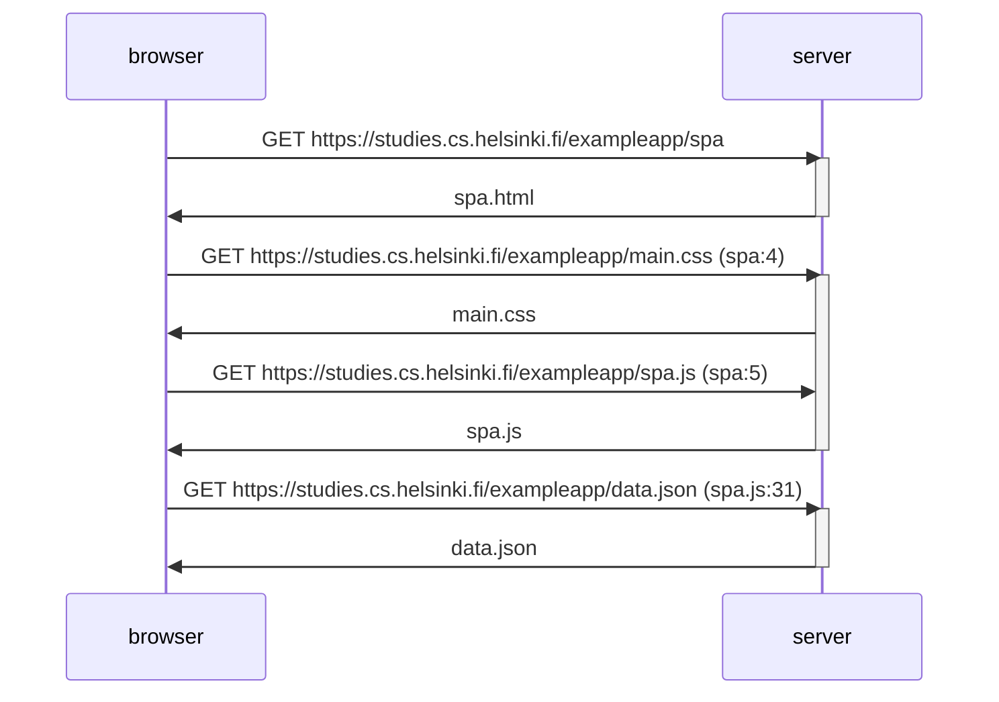

```mermaid
sequenceDiagram
  participant browser
  participant server

  browser->>server: GET https://studies.cs.helsinki.fi/exampleapp/spa
  activate server
  server->>browser: spa.html
  deactivate server

  browser->>server: GET https://studies.cs.helsinki.fi/exampleapp/main.css (spa:4)
  activate server
  server->>browser: main.css
  browser->> server: GET https://studies.cs.helsinki.fi/exampleapp/spa.js (spa:5)
  server->>browser: spa.js
  deactivate server

  browser->>server: GET https://studies.cs.helsinki.fi/exampleapp/data.json (spa.js:31)
  activate server
  server->>browser: data.json
  deactivate server
```
